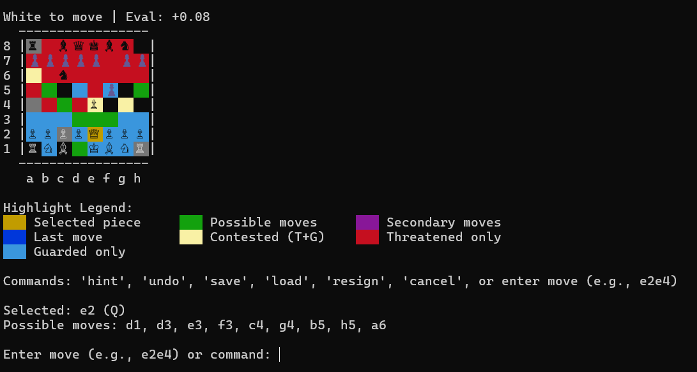

# Chess RL from scratch — the Trivium Recipe 🏰
*A from-scratch RL agent that holds 1428–1672 Elo beyond doubt — trained on pure self-play
with nothing deeper than a 2-ply glance*

## ⭐ The enshrined lesson

**Sparse-depth trivium RL works.** Compound value targets — the *trivium*:
`λ-return : search-value : outcome`, weights **annealed on an Optuna-tuned schedule** — let a
linear eval climb from scratch on pure self-play with **no deep search anywhere in training**:
λ (eligibility-trace horizon, the n-step-advantage analog) replaces depth, a 2-ply glance
keeps targets sound, the outcome term anchors early and anneals away. Depth is spent only at
*play time*, where it converts the learned eval into strength.

**Claims-grade result: 1484 Elo (95% CI 1434..1542), 98W-92D-10L over 200 games vs
Stockfish@1320** — the entire interval inside the 1428–1672 goal band, from a net that never
saw an external opponent or an engine label in training (15k self-play games). The recipe
reproduced on a fresh restart: the prior campaign's peak matched in half the games.

Canonical spec: [`spec/trivium.spec.md`](spec/trivium.spec.md) · lessons: [`LESSONS.md`](LESSONS.md)
· rollback map: [`ROLLBACK.md`](ROLLBACK.md) · everything superseded:
[`spec/dispositioned.md`](spec/dispositioned.md)

## 🎯 Quick Start
```bash
python main.py
```

## 🧪 From-Scratch RL Ladder (Merge 2 — Q-learning, current work)

The from-scratch rung lives in `qlearn.py` (specs in `spec/`). Two ways to drive it:

### Training console (browser UI)
```bash
python app.py          # boots FastAPI + opens http://127.0.0.1:8000/
```
Settings form (preloaded via "Load Optuna best"), start/stop, and live plots: nominal score & actual
Elo vs SF@1320, loss, trace σ, material margin, turns, strength, learned piece worth, avg reward,
checkmate rate. Training runs detached — it survives browser refreshes and server restarts.

### Optuna study (hyperparameter tuning)
```bash
python tune_qlearn.py [n_trials] [sample_games] [max_epochs] [elo_games] [batch_games]
python tune_qlearn.py 5 200 3 20 20      # the standard protocol
```
Tunes the ALGORITHMIC knobs only — {γ decay, α step, λ trace, warmup ratio} via TPE seeded at
literature priors. **Sample size and batch size are infrastructure controls: passed fixed, never
searched** (batch ≤ sample is asserted). Studies persist in `models/qlearn_optuna.db` under a name
FINGERPRINTED by (search space, training regime, protocol): rerunning with the same settings RESUMES
the study — TPE keeps learning from all prior trials — while any change starts a fresh study alongside
(old ones are kept; never delete the DB). One trainer at a time: don't run a study and a console run
together (they share `data/qlearn_metrics.jsonl`).
Objective = final SF@1320-anchored Elo (`KILL-CHECK elo` line); render the verdict report with
`python report_qlearn.py`.

### First Time Setup
1. The AI will automatically create `models/` and `training_plots/` directories
2. Pre-trained models should be placed in the `models/` directory
3. Training plots are saved to `training_plots/` (no interactive plots during training)

## 🖼️ Interface Demo

### Enhanced Terminal Chess Interface

## Release History
- **1.4** 🆕 Improved model management, fixed training issues, non-interactive training plots
- **1.3** Bug fixes with Claude Opus 4
- **1.2** Better color matching for terminal display
- **1.1** AHA learning disabled by default
- **1.0** Initial Release with full feature set

### Current Version

| Version 1.4 |
|--------------|
|  |

**Key Visual Features:**
- 🟡 **Selected Piece** - Yellow highlighting
- 🟢 **Possible Moves** - Green squares  
- 🟣 **Secondary Moves** - Magenta (2-move sequences)
- 🔵 **Last Move** - Blue highlighting
- 🔴 **Threatened Squares** - Red background
- 🟦 **Guarded Squares** - Cyan background
- 🟨 **Contested Squares** - Yellow (both threatened + guarded)

## 🆕 Version 1.4 Improvements

### Model Management
- Models now default to `models/` directory
- Automatic path detection when loading models
- Clear prompts when default models are found

### Training Enhancements
- Training plots automatically saved to `training_plots/` directory
- No more interactive matplotlib windows during training
- Latest game always saved as `latest_game_progression.png`
- Summary plots generated after training completion

### Bug Fixes
- Fixed `chess` module import errors in neural network
- Resolved tensor shape mismatch warnings
- Fixed matplotlib/tkinter threading issues
- Corrected variable name errors in menu system
- Suppressed matplotlib debug logging

### AHA Learning Changes
- Now **disabled by default** (opt-in feature)
- Must be explicitly enabled during training setup
- Clear status display in menu

## ✨ What Makes This Different

### 🧠 AHA Learning - Learning from Mistakes in Real Time (Optional)
When enabled, the AI can detect significant evaluation drops and:
- Immediately update its neural network with the mistake
- Search for a better alternative 
- Self-correct during training (limited budget per game)

**Note**: AHA Learning is OFF by default. Enable it in the training menu if desired.

### 🎯 Russian Doll MCTS - Smart Search Narrowing
Instead of exploring moves randomly, the search progressively narrows:
```
21 promising moves → 13 best → 8 better → 5 good → 3 solid → 2 strong → 1 choice
```
Each level is weighted by tactical significance (captures, checks, threats, development).

### 🖼️ Enhanced Terminal Interface
- **Real-time highlighting** as you type coordinates
- **Color-coded threats** (red) and protection (cyan)
- **Move possibilities** shown instantly when selecting pieces
- **Score tracking** with live evaluation updates
- **Secondary moves** highlighting 2-move sequences

## 🏗️ Architecture
```
Russian Doll MCTS + Deep Q-Network
         ↓
Weighted Move Sampling by Chess Logic
         ↓  
Parallel Tree Search (Multi-core)
         ↓
CNN Position Evaluation + Game Experience
```

### Core Components
- **chess_ai.py**: Main AI orchestration with training loops
- **neural_network.py**: CNN-based Q-network with optional AHA learning
- **mcts.py**: Russian Doll MCTS with progressive narrowing
- **evaluation.py**: Chess position scoring (material, mobility, safety, structure)
- **terminal_board.py**: Rich terminal interface with real-time highlighting

## 🎮 Features

### Training
- **Self-play learning** with experience replay
- **Training plots saved to disk** (no interactive windows)
- **Continuing training** from saved models
- **AHA Learning** for mistake correction (optional, off by default)
- **Progress tracking** with loss curves and game statistics

### Playing
- **Interactive terminal** with coordinate input and visual feedback
- **Move hints** from the AI's current policy
- **Undo system** for taking back moves
- **Save/load games** in PGN format
- **Real-time evaluation** display

### Analysis
- **Training progress plots** saved to `training_plots/`
- **Game evaluation tracking** across all training games
- **ELO estimation** by playing against Stockfish
- **Performance metrics** and statistical analysis

## 🔧 Technical Details

### File Organization
```
chess-deep-q/
├── models/              # Saved model files (.pth)
├── training_plots/      # Training visualization plots
├── saved_games/         # Saved games in PGN format
├── logs/               # Application logs
└── *.py                # Source code files
```

### Search Algorithm
- **Russian Doll MCTS**: 7 levels of progressive narrowing
- **Weighted sampling**: Moves categorized by tactical importance
- **Parallel processing**: Multi-threaded search using available CPU cores
- **Annealing**: Search parameters adjust based on training progress

### Neural Network
- **CNN Architecture**: 12-channel input (piece positions) → Conv2D layers → Value output
- **Deep Q-Learning**: Experience replay with target network updates
- **CUDA Support**: Automatic GPU acceleration when available
- **AHA Learning**: Real-time mistake correction during training (optional)

### Position Evaluation
Comprehensive scoring based on:
- **Material balance** (piece values)
- **Mobility** (legal moves and attacked squares)
- **King safety** (attacks, castling, central exposure)
- **Pawn structure** (doubled, isolated, chains)
- **Space control** (center and extended center)
- **Piece coordination** (defended pieces, development)

## 🎯 Usage Examples

### Basic Training (AHA Learning OFF by default)
```python
chess_ai = OptimizedChessAI(training_games=20, verbose=True)
chess_ai.train()
chess_ai.save_model("my_model.pth")  # Saves to models/my_model.pth
```

### Enable AHA Learning
```python
chess_ai = OptimizedChessAI(
    training_games=50, 
    use_aha_learning=True  # Must explicitly enable
)
chess_ai.train()
```

### Continue Training
```python
chess_ai.load_model("chess_model.pth", continue_training=True)  # Loads from models/
chess_ai.training_games += 30  # Train 30 more games
chess_ai.train()
```

## 🎮 Playing the Game

### Terminal Commands
```bash
e2      # Select piece at e2 (highlights possible moves)
e4      # Move to e4
e2e4    # Complete move notation
hint    # Get AI's suggested move
undo    # Take back your last move
save    # Save current game
load    # Load a saved game
resign  # Resign the game
cancel  # Cancel piece selection
```

### Visual Interface
- 🟡 **Selected piece** highlighted in yellow
- 🟢 **Possible moves** in green
- 🟣 **Secondary moves** (2-move sequences) in magenta  
- 🔵 **Last move** highlighted in blue
- 🔴 **Threatened squares** in red
- 🟦 **Guarded squares** in cyan

## 📊 Training Features

### Non-Interactive Training
- **Plots saved automatically** to `training_plots/`
- **No matplotlib windows** during training (prevents GUI issues)
- **Latest game plot** always available as `latest_game_progression.png`
- **Summary plots** generated after training completion

### Saved Training Plots
1. `latest_game_progression.png` - Most recent game's score progression
2. `evaluation_trends.png` - Final evaluation across all games
3. `training_progress.png` - Loss, epsilon, evaluation, and move counts
4. `final_game_scores.png` - Bar chart of final scores
5. `move_counts.png` - Moves per game trend

### Analysis Tools
- **Performance curves** showing learning progress
- **Material exchange tracking** 
- **Game outcome statistics**
- **ELO rating estimation** via Stockfish play

## 🛠️ Requirements
```bash
pip install torch numpy chess matplotlib colorama tqdm scipy pandas
```

### Optional
- **Stockfish** chess engine (for ELO evaluation only)
- **CUDA** compatible GPU (for faster training)

## 🐛 Known Issues & Solutions

### Issue: "chess module not defined"
**Solution**: Fixed in v1.4 - ensure you're using the latest version

### Issue: Matplotlib GUI errors during training
**Solution**: Fixed in v1.4 - plots now save to disk instead of displaying

### Issue: Can't find model files
**Solution**: Models are now saved/loaded from `models/` directory by default

### Issue: Too many debug logs
**Solution**: Matplotlib debug logging suppressed in v1.4

## 🚀 Innovation Highlights

### AHA Learning System (Optional)
A novel approach where the AI can recognize mistakes during training:
```
Move → Evaluation Drop Detected → Neural Network Update → Better Alternative → Improved Policy
```

### Russian Doll MCTS  
Efficient tree search that concentrates computation on promising moves:
```
Categorical Move Weighting → Progressive Sampling → Narrowing Focus → Best Move Selection
```

### Enhanced User Experience
Real-time visual feedback system that makes chess analysis intuitive and educational.

## 🔮 Future Features & Development Roadmap

### Strategic Evaluation Enhancements

**1. Position-Adaptive Evaluation Weights**
- Implement dynamic evaluation weights that adjust based on position characteristics (e.g., open/closed position, material imbalance)
- Add a position classifier that can recognize key position types and modify evaluation parameters accordingly

**2. Strategic Pattern Recognition**
- Implement detection of common chess patterns (e.g., bishops of opposite colors, IQP positions, minority attacks)
- Add evaluation terms for important strategic themes (e.g., piece quality, color complex weaknesses, compensation for material)
- Create a database of strategic patterns with corresponding evaluation adjustments

**3. Phase-Specific Evaluation**
- Develop separate evaluation functions for opening, middlegame, and endgame
- Implement phase detection to smoothly transition between evaluation functions
- Apply different piece values and positional weights based on game phase
- Integrate specialized endgame evaluations (e.g., king activity becomes more important)

### Search and Learning Improvements

**4. Enhanced MCTS Implementation**
- Replace Python threads with multiprocessing for true parallel search
- Implement batched MCTS with vectorized operations for GPU acceleration
- Add progressive move widening to dynamically adjust search breadth based on position complexity
- Implement threat detection and extension for horizon effect mitigation

**5. Advanced Reinforcement Learning**
- Replace basic Q-learning with TD(λ) or other temporal difference methods with eligibility traces
- Implement prioritized experience replay with importance sampling
- Add curriculum learning progression (start with endgames, advance to middlegames and openings)
- Develop a more nuanced reward function that captures practical winning chances

**6. Hybrid Learning Approach**
- Add supervised learning pre-training using a database of master games
- Implement self-play with expert iteration to combine MCTS and neural guidance
- Create a validation system using classic chess puzzles to test tactical understanding

### Technical Optimizations

**7. Neural Network Architecture Refactoring**
- Replace the current CNN with a more modern architecture using residual connections
- Reduce fully-connected layer size using 1×1 convolutions to maintain spatial information
- Add batch normalization for faster training convergence
- Implement optional model quantization for inference acceleration

**8. Memory Management Enhancements**
- Replace dictionary cache with a proper LRU cache implementation
- Implement Zobrist hashing for efficient position representation
- Add prefetch functionality for likely next positions
- Implement incremental evaluation updates to avoid full recalculation

**9. Optimized Batch Processing**
- Standardize batch processing throughout the system
- Reduce device transfer overhead with larger, less frequent transfers
- Create a dedicated GPU evaluation pipeline for position batches
- Add adaptive batch sizing based on hardware capabilities

**10. Performance Profiling Framework**
- Add comprehensive performance profiling capabilities
- Implement logging of training metrics, search statistics, and system resource usage
- Create a benchmarking system for comparing versions and configurations
- Add A/B testing capability for evaluating system changes

### User Experience Enhancements

**11. Improved Game Analysis**
- Add visualization of the AI's "thought process" during move selection
- Implement move explanation that describes strategic and tactical considerations
- Create position evaluation breakdowns showing contribution of different factors
- Add a feature to analyze user games with commentaries

**12. Training Management Interface**
- Develop a dashboard for monitoring training progress with key metrics
- Add checkpointing and resumable training with configurable parameters
- Implement automatic hyperparameter tuning
- Create visualization of neural network learning progress

**13. Adaptable Playing Strength**
- Add configurable playing strength levels that go beyond simple search depth adjustment
- Implement personality profiles with different strategic preferences
- Create a progressive learning mode that adapts to the user's skill level
- Add coaching features that suggest alternative moves and explain mistakes

### Implementation Priorities

**🔥 High Priority:**
- Position-adaptive evaluation weights (#1)
- Phase-specific evaluation (#3)
- Enhanced MCTS implementation (#4)
- Neural network architecture refactoring (#7)
- Memory management enhancements (#8)

**⚡ Medium Priority:**
- Strategic pattern recognition (#2)
- Advanced reinforcement learning (#5)
- Optimized batch processing (#9)
- Performance profiling framework (#10)
- Improved game analysis (#11)

**📋 Lower Priority:**
- Hybrid learning approach (#6)
- Training management interface (#12)
- Adaptable playing strength (#13)

*These requirements aim to significantly improve both the chess understanding and computational efficiency of the system while maintaining a balance between immediate practical improvements and longer-term architectural enhancements.*

## 📄 License
MIT License - Built for chess enthusiasts and AI researchers.

---
**"In chess, as in learning, the best move often comes after recognizing the worst one."**