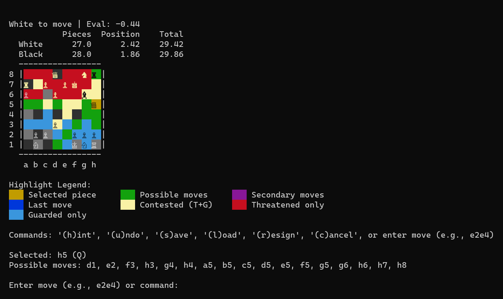

# Chess RL from scratch — the Trivium Recipe 🏰
*A from-scratch RL agent whose champion measures **1878 Elo (95% 1756..2000)** — multi-anchor
MLE over 50 games at depth 9 vs Stockfish@1500–2300 (the earlier 1724 figure was the Wilson
floor of a saturated single-anchor scout; consistent, now superseded) — trained on pure
self-play with nothing deeper than a 2-ply glance*

## ⭐ The enshrined lesson

**Sparse-depth trivium RL works.** Compound value targets — the *trivium*:
`λ-return : search-value : outcome`, weights **annealed on an Optuna-tuned schedule** — let a
linear eval climb from scratch on pure self-play with **no deep search anywhere in training**:
λ replaces depth, a 2-ply glance keeps targets sound, the outcome term anchors early and
anneals away. Depth is spent only at *play time*, where it converts the learned eval into
strength.

**Current champion (`models/champion.pt`): the amap-897 net** — pst-769 planes ⊕ attack-coverage
maps, the campaign's first confirmed feature win (+51/+72 Elo across two independent seeds).
The 1320 anchor saturates above ~1700, so the honest claim is a floor, not a point estimate.

## 🎯 Quick Start

### Lane 1 — just play (pip only, no Rust)
```bash
pip install -r requirements.txt
python main.py     # play the pretrained champion in the terminal
python app.py      # training console (browser UI at http://127.0.0.1:8000/)
```
That's it — the pretrained CHAMPION plays out of the box on a pure-Python alpha-beta search over
its distilled weights. No compiler, no toolchain. It's slower than the native engine and the
dynamic-difficulty dial is native-only, but it plays full-strength moves.

### Lane 2 — native search (optional, faster)
For full-speed native d9 search (and the difficulty dial), build the Rust extension once. The
CHAMPION auto-detects it and uses it when present, otherwise transparently falls back to Lane 1.
```bash
pip install maturin
cd rsearch
maturin develop --release       # requires a Rust toolchain — rustup, https://rustup.rs
```
Only the CHAMPION benefits from `rsearch4`; the other agents (net+PUCT, alpha-beta engine, beam,
nnue) never needed it.

## 🖼️ In the thick of it

| Queen selected — coverage map live (threatened red, guarded cyan, contested cream) |
|--------------|
|  |

Regenerate anytime: `python experiments/board_still.py <seed>`.

## 📚 Documentation

| Doc | What's in it |
|-----|--------------|
| [`docs/GUIDE.md`](docs/GUIDE.md) | Playing commands, training console & Optuna protocol, architecture, release history, roadmap |
| [`spec/trivium.spec.md`](spec/trivium.spec.md) | Canonical spec of the recipe |
| [`docs/LESSONS.md`](docs/LESSONS.md) | Enshrined lessons from the campaign |
| [`docs/ROLLBACK.md`](docs/ROLLBACK.md) | Rollback map |
| [`spec/dispositioned.md`](spec/dispositioned.md) | Everything superseded |
| [`future_exploration.md`](future_exploration.md) | Live research frontier (arm ledger, verdicts) |

## 📄 License
MIT License - Built for chess enthusiasts and AI researchers.

---
**"In chess, as in learning, the best move often comes after recognizing the worst one."**
